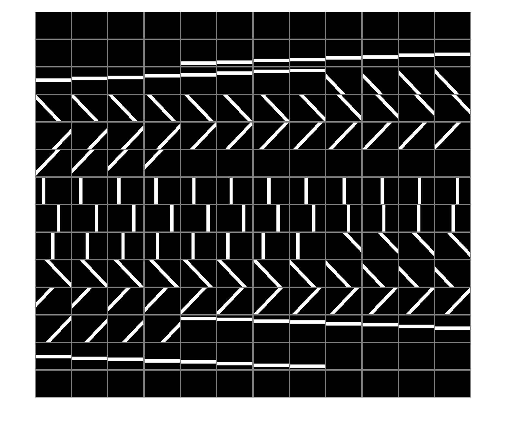
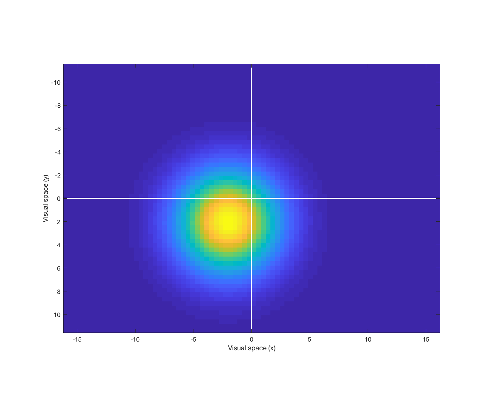
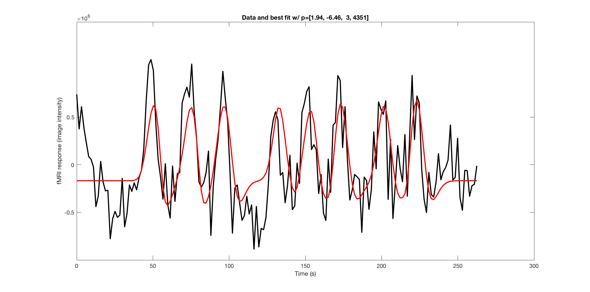
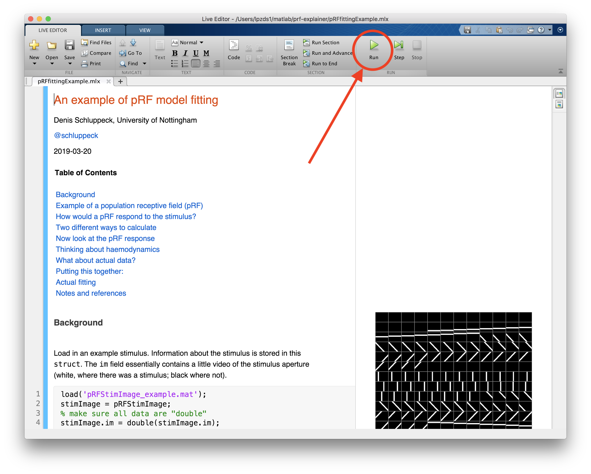

# prf-explainer

Interactive (matlab) code illustrating the population receptive field mapping technique (Dumoulin &amp; Wandell)


In short - how do you get from stimulus description and pRF (top 2 images), to a model fit (bottom)?

<center>

</center>


## To get going

This walk-through is written as an [live script in Matlab](https://uk.mathworks.com/help/matlab/matlab_prog/what-is-a-live-script-or-function.html),which is The Mathworks's answer to the "literate coding" idea.

1. ``git clone`` this repository (assuming macOS). Use Windows magic to achieve the same:
```bash
cd ~
git clone https://github.com/schluppeck/prf-explainer.git
```

2. In `matlab`, open the live script
```MATLAB
cd ~/prf-explainer
open('pRFfittingExample')
```

3. Hit the play button and walk through the different cells:
<center>

</center>

## Lee method

- Check out branches in this repo to see how `lee et al` method using L2/L1 regularised pRF was added.


## Notes and references

Tested with MATLAB Version: 9.4.0.813654 (R2018a) on macOS. If you find errors, typos, better ways of doing things, submit and issue on the github repo.

- [Serge Dumoulin's homepage (original paper, software)](http://www.spinozacentre.nl/dumoulin/)
- [Brian Wandell's homepage](https://web.stanford.edu/group/vista/cgi-bin/wandell/)
- [Justin Gardner's homepage](http://gru.stanford.edu/doku.php/shared/home)
- [mrTools implementation (and tutorial for how to use)](http://gru.stanford.edu/doku.php/mrTools/tutorialsprf)
- my *Data Analysis for Neuroimaging* lab / teaching materials are hosted here: [https://schluppeck.github.io/dafni/](https://schluppeck.github.io/dafni/)
