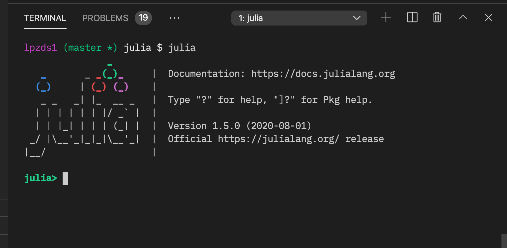

## `julia` version of pRF code

### What you'll need

- download + install `julia` (this version here made with v"julia version 1.5.0")

- add packages to fullfil dependencies

use `julia` in shell, to get a command prompt. I run from `bash` or within `VS code`.




```julia
import Pkg
# list of packages
p = ["NIfTI", "MAT", "Plots", "Colors", "LinearAlgebra", "ImageFiltering", "StatsBase", "Distributions", "LsqFit"]
Pkg.add(p)
# wait for installs.
```

Then you can try running the code (!NB data files are in parent dir for now (where matlab code lives)).

```julia
include("pRF_nls.jl")
# and hopefully figures will pop up
# if not, try
pboot_  # figure handle
# and
hm_
```
